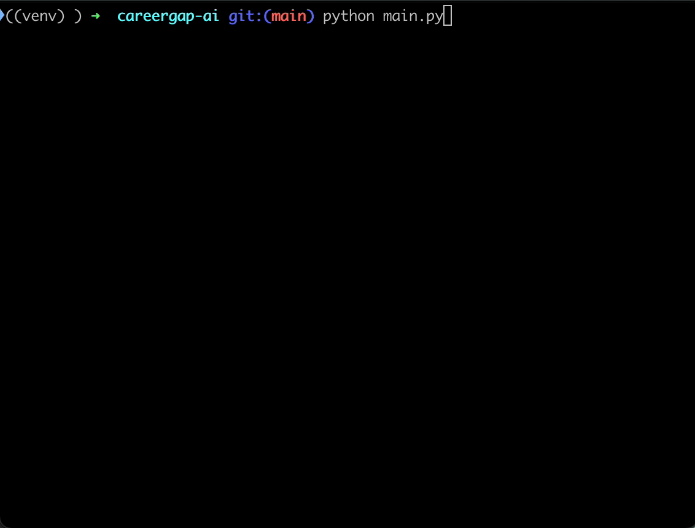

# CareerGap AI 🧠

**CareerGap AI** is a modular Python-based auditing tool designed to automate the cross-referencing of resumes against job descriptions. It leverages LLMs and strict schema validation to identify technical skill gaps, recommend targeted resume projects, and persist career analytics to a cloud database.



## 🏗 Architecture & Core Principles
This project was built with a focus on **Data Integrity** and **PII Safety**, reflecting a transition from enterprise TypeScript development into AI Orchestration and Data Engineering.

* **Modular Design:** Separate concerns across Ingestion (`ingestion.py`), Analysis (`analyzer.py`), and Persistence (`database.py`).
* **Structured Output:** Uses **Pydantic** to enforce strict data contracts between the LLM and the PostgreSQL database.
* **Security First:** Implements a **PII-safe** environment through rigorous `.gitignore` policies and Git history remediation to ensure sensitive resume data is never exposed.

## 🛠 Tech Stack
* **Language:** Python 3.12
* **AI:** OpenAI GPT-4o-mini, LangChain
* **Database:** Supabase (PostgreSQL)
* **Validation:** Pydantic
* **Containment:** Docker & Docker Compose

## 🚀 Key Features
1.  **PDF Resume Ingestion:** Automated text extraction from local PDF files.
2.  **AI-Driven Gap Analysis:** Real-time comparison of resume skills against JDs with 0-100 match scoring.
3.  **Historical Retrieval:** A search-enabled "History View" to query and filter past analyses from Supabase.
4.  **Strategic Aggregation:** A reporting tool that identifies the most frequent skill gaps across multiple job postings to suggest high-impact "Master Projects."

## 🚦 Getting Started

The easiest way to run this project is using the automated setup script.

1. **Clone the repo:** `git clone https://github.com/lgivhan/careergap-ai`
2. **Configure Secrets:** Create a `.env` file with your `OPENAI_API_KEY`, `SUPABASE_URL`, and `SUPABASE_KEY`.
3. **Launch:** Run `./setup.sh` and follow the prompts.

> **Note:** This project includes a production-ready Docker configuration for environment parity. If you have Docker installed, you can launch the containerized service via docker-compose up. The setup script automatically manages your virtual environment, installs dependencies from `requirements.txt`, and gives you the option to run the app via Docker or locally.

## 🚀 Usage

### 1. Prepare your Resume
Place your resume in the root directory and rename it to `my_resume.pdf`. (This file is ignored by Git to maintain **PII-safety**).

### 2. Launch the Interactive Menu
The setup script provides a central menu for all application features:
```bash
./setup.sh
```

### Running Scripts Directly (Optional)
1. **Run Analysis:** `python main.py`
2. **View History:** `python history.py [company_name]` for specific company or just `python history.py` to return all.
3. **Generate Strategy:** `python aggregate_analysis.py`

## 🛠 Challenges & Solutions
* **Non-Deterministic Output:** Resolved LLM consistency issues by binding Pydantic models to the output chain, ensuring valid JSON every time.
* **PII Exposure:** Remediated an initial tracking of personal data by performing a deep Git history scrub using `git-filter-repo` and establishing strict environment controls.
* **API Quota Management:** Optimized token usage by selecting the `gpt-4o-mini` model and implementing local caching strategies during development.

---
*Created by Lee Givhan — Software Engineer to gain experience with AI, Data Validation, and Reliable Systems.*